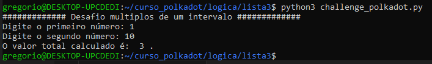

Para executar o código: python3 challenge_polkadot.py

Você deverá informar dois números em sequência para definir o intervalo. Após definir o intervalo o programa segue as regras definidas no exercício.

